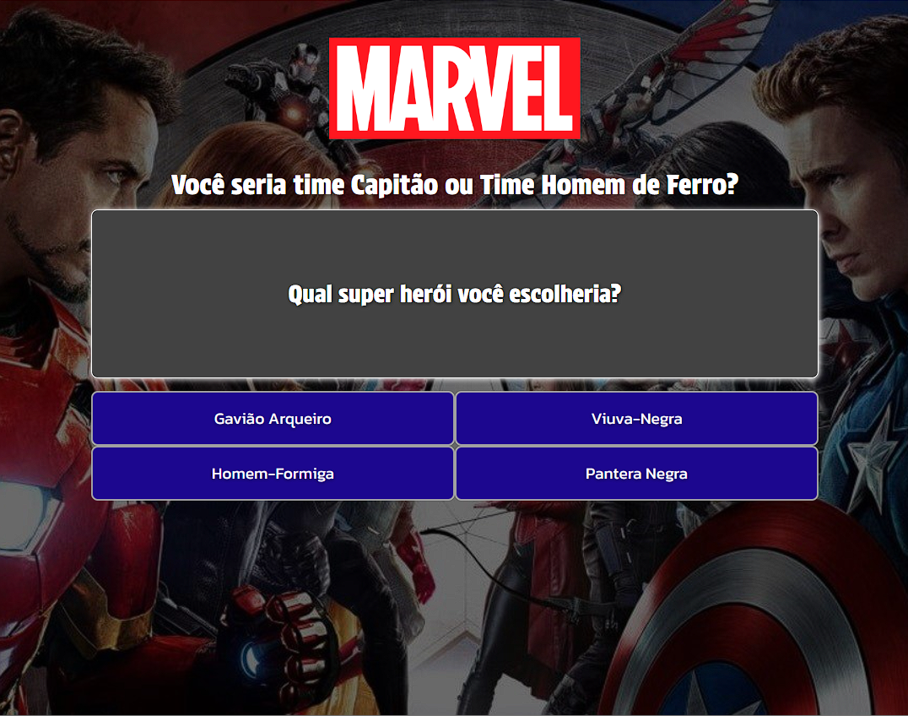
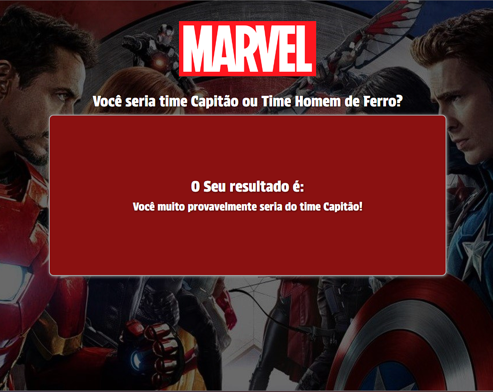

# Marvel BuzzFeed 🖥️🎯

## Descrição 📃

Este projeto foi gerado com [Angular CLI](https://github.com/angular/angular-cli) version 14.1.2, no bootcamp Coding The Future Banco PAN - Desenvolvimento Frontend com Angular, com o Felipe Aguiar, na plataforma da [Dio](https://www.dio.me/)!

## Tecnologias utilizadas 🛠️

## Resultados 🚩

Veja o resultado do site na imagem abaixo:

> OBS: As imagens utilizadas é apenas de inlustração para aplicar os conhecimentos na prática, sendo elas retiradas de outros sites!!

## Links 🔗

- [🔍 Digital Innovation One](https://www.dio.me/)
- [🔍 Angular CLI ](https://angular.io/cli)
